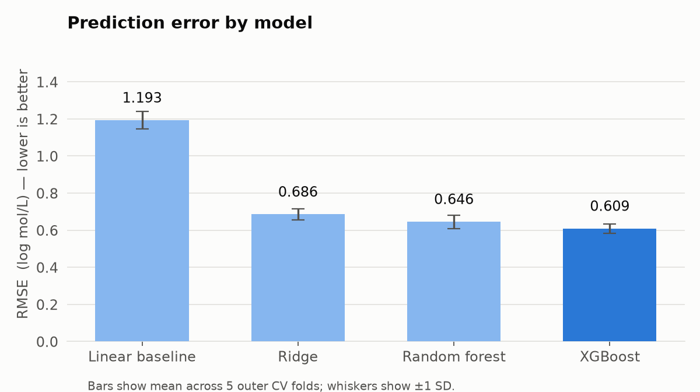
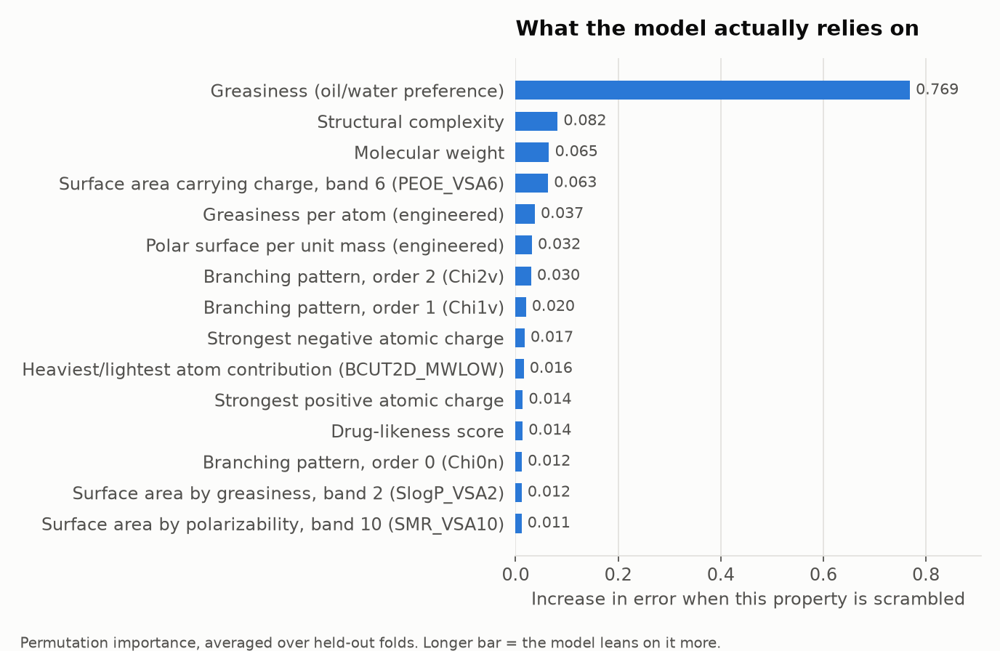

# PropertyPredict

**Predicting a continuous chemical property — aqueous solubility — from molecular
structure alone, with an end-to-end scikit-learn pipeline.**

Give it a molecule as a SMILES string. It returns how well that molecule
dissolves in water, in log mol/L, with an honest error bar.

```
Aspirin   CC(=O)Oc1ccccc1C(=O)O  →  -1.95 log mol/L  (≈ 2,000 mg/L, "soluble")
Caffeine  Cn1cnc2c1c(=O)n(C)c(=O)n2C  →  -0.77 log mol/L  ("very soluble")
DDT       Clc1ccc(C(...)Cl)cc1   →  -7.03 log mol/L  ("practically insoluble")
```

## Headline result

| Model | RMSE (log mol/L) | MAE | R² |
|---|---|---|---|
| Linear baseline (6 stock descriptors) | 1.193 ± 0.047 | 0.933 | 0.675 |
| Ridge | 0.686 ± 0.031 | 0.511 | 0.893 |
| Random forest | 0.645 ± 0.036 | 0.466 | 0.905 |
| **XGBoost** | **0.609 ± 0.026** | **0.435** | **0.915** |

**XGBoost cuts RMSE 49% against the linear baseline** and explains 92% of the
variance in measured solubility. 91% of molecules land within one log unit
(a 10x factor) of their measured value. Every number comes from nested cross-validation
— see *Why these numbers are trustworthy* below.



Full write-up with all four charts: **[results.md](results.md)**

## Run it

```bash
python3 -m venv .venv
source .venv/bin/activate            # Windows: .venv\Scripts\activate
pip install -r requirements.txt

python src/run.py                    # trains everything, writes results.md + reports/  (~5 min)
streamlit run app.py                 # the UI
```

`src/run.py` downloads nothing — `data/esol.csv` is committed.

## The UI

A single-screen Streamlit app aimed at someone who knows chemistry but not
machine learning. Paste a structure (or pick an example), get:

- the prediction in **log mol/L and in mg/L**, plus a plain-English band
  ("soluble", "practically insoluble")
- the model's typical error stated as a range, not hidden
- where this molecule sits against the 1,117 it was trained on
- a batch tab: paste a list, get a table and a CSV

## How it works

```
data/esol.csv  →  cleanse  →  221 descriptors  →  Pipeline  →  nested CV  →  results.md
                                                      ↓
                                            models/best_model.joblib  →  app.py
```

**Cleansing** (`clean()` in `src/pipeline.py`)
- Drops the dataset's `ESOL predicted log solubility` column. It is a previously
  published model's *prediction of the target*, shipped alongside it. Left in, it
  produces spectacular scores that measure nothing.
- Canonicalizes every SMILES before de-duplicating. This surfaced **11 molecule
  pairs listed twice under different names** — Guaiacol / o-Methoxyphenol,
  Dialifos / Dialifor, phenobarbital / 5-Ethyl-5-phenylbarbital. Their SMILES
  strings differ as text, so string matching misses them entirely. Left in, the
  same molecule lands in a training fold and a test fold at once and the model
  gets scored on something it memorized. Duplicates are merged, measurements
  averaged.
- Guards against extreme target outliers (3× IQR) and imputes missing descriptor
  values from the **training fold's** median, inside the pipeline.

**Features** — ~216 RDKit descriptors per molecule, plus 5 engineered ratios
motivated by the physics: polar surface per unit mass, greasiness per atom, total
hydrogen-bond sites, average atom weight, aromatic ring fraction. Solubility is a
tug-of-war between polar surface area and bulk, and the raw descriptors carry the
numerator and denominator separately; these hand the model the ratio.

**Model selection** — ridge, random forest, and XGBoost, each with a randomized
hyperparameter search. The correlation-filter threshold is itself a searched
hyperparameter, so feature selection is tuned rather than guessed.

## Why these numbers are trustworthy

The whole point of the design is that nothing about a test molecule can reach the
model that predicts it.

- **Nested cross-validation.** An outer 5-fold split measures error. Inside each
  outer *training* fold, a separate 3-fold search picks hyperparameters. Tuning
  never sees the fold it is scored on. Tuning and scoring on the same split is
  the single most common way ML results get quietly inflated.
- **Every fitted step lives inside the `Pipeline`** — imputation, variance
  filtering, correlation filtering, scaling. Median-imputing or scaling before
  the split leaks test-set statistics into training. Here they are refit from
  scratch on each training fold.
- **Duplicate structures merged before splitting**, so no molecule appears on
  both sides of a fold.
- **Permutation importance is computed on held-out folds**, not on training data,
  so the reported drivers are what the model uses to *generalize*.

## What drives the prediction



Greasiness (`MolLogP`) dominates, followed by structural complexity, molecular
weight, and charged surface area — and two of the engineered ratios make the top
six. The model rediscovers the actual chemistry: water pulls a molecule apart at
its polar, hydrogen-bonding surfaces, and the molecule resists in proportion to
how large and how greasy it is. Nobody encoded that rule.

## Files

| Path | What it is |
|---|---|
| `src/pipeline.py` | Loading, cleansing, featurization, pipeline + search-space definitions |
| `src/run.py` | Nested-CV benchmark, charts, report generation |
| `app.py` | Streamlit UI |
| `results.md` | Generated write-up |
| `reports/` | Generated charts and `metrics.json` |

## Data

[ESOL / Delaney](https://pubs.acs.org/doi/10.1021/ci034243x), 1,128 compounds with
measured aqueous solubility; 1,117 after de-duplication. A standard benchmark, so
the numbers above are comparable to published work.

## Limitations

- Trained on small, mostly drug- and pesticide-like organic molecules. Predictions
  for polymers, salts, or organometallics are extrapolation.
- Descriptors are 2D — no conformers, no crystal packing, and crystal lattice
  energy is a real part of why solids do not dissolve.
- 0.61 log units of error is a factor of ~4 in concentration. Useful for ranking
  and triage; not a replacement for measurement.
