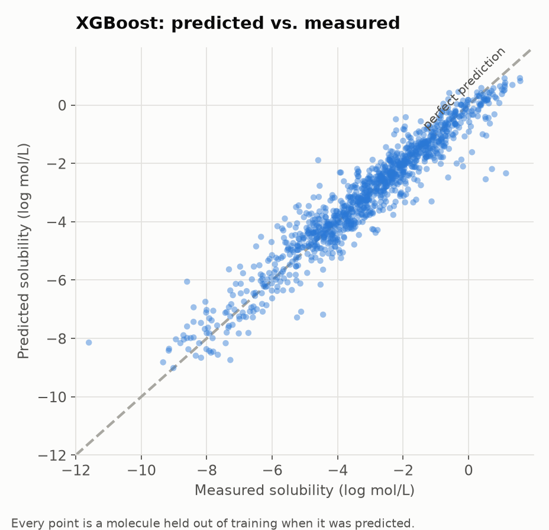
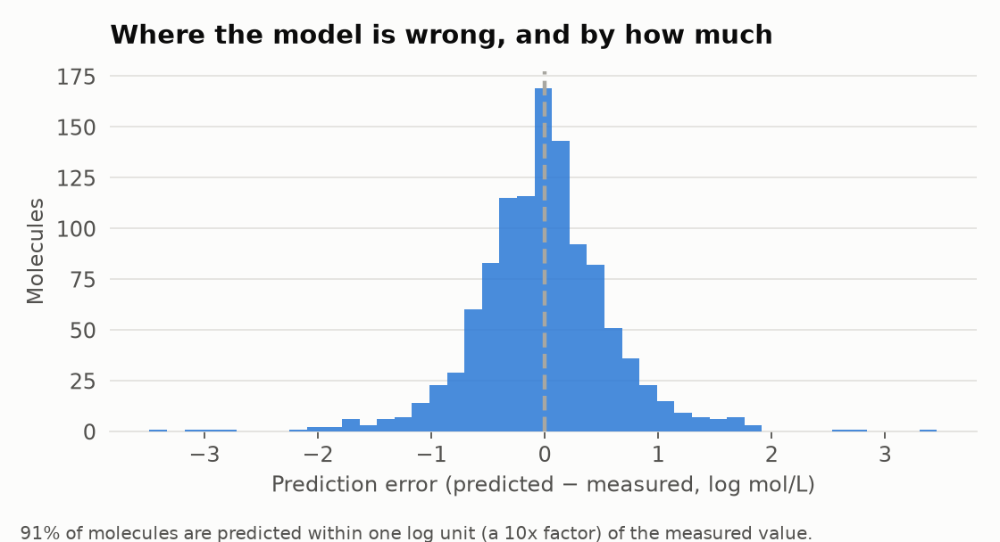

# Results

Predicting aqueous solubility (log mol/L) for 1117 molecules
from structure alone. All numbers below come from **nested cross-validation**:
an outer 5-fold split measures error, and hyperparameters are searched only
inside each outer training fold. No test molecule influenced its own prediction.

## Headline

**XGBoost cut RMSE by 49.0% against the linear baseline**
(1.193 → 0.609 log units), explaining
92% of the variance in measured solubility.

### Where the gain came from

The improvement is not one thing. Splitting it:

| Step | RMSE | Change |
|---|---|---|
| Linear regression, 6 stock descriptors | 1.193 | — |
| Ridge, 221 engineered features | 0.686 | −43% (richer features + selection) |
| XGBoost, same features, tuned | 0.609 | −11% (nonlinear model + tuning) |

Most of the win comes from giving the model better inputs, not from a fancier
algorithm. That is the usual shape of the result, and worth saying out loud.

## Model comparison

| Model | RMSE (mean ± SD across folds) | MAE | R² |
|---|---|---|---|
| Linear baseline | 1.193 ± 0.047 | 0.933 | 0.675 |
| Ridge | 0.686 ± 0.031 | 0.511 | 0.893 |
| Random forest | 0.646 ± 0.037 | 0.465 | 0.905 |
| XGBoost | 0.609 ± 0.026 | 0.435 | 0.915 |

The baseline is ordinary least squares on the six descriptors shipped with the
dataset. Every other model sees the full engineered feature set
(221 features) and gets a randomized hyperparameter search.

## Predictions vs. reality

## What drives the prediction

1. **Greasiness (oil/water preference)** — permutation importance 0.769
2. **Structural complexity** — permutation importance 0.082
3. **Molecular weight** — permutation importance 0.065
4. **Surface area carrying charge, band 6 (PEOE_VSA6)** — permutation importance 0.063
5. **Greasiness per atom (engineered)** — permutation importance 0.037

**In plain language:** solubility comes down to a tug-of-war. Water pulls a
molecule apart at its polar, charged, hydrogen-bonding surfaces; the molecule
resists in proportion to how large and how greasy it is. The model rediscovers
this on its own — the features it leans on hardest are exactly the ones that
measure greasiness, size, and polar surface. Nobody told it the chemistry.

## Data cleansing

| Step | Rows removed |
|---|---|
| Duplicate structures merged (matched only after canonicalization) | 11 |
| Unparseable SMILES | 0 |
| Extreme target outliers (outside (-12.44, 6.53)) | 0 |

One column was dropped outright: *"ESOL predicted log solubility"*, which is a
previously published model's prediction of the target. Keeping it would have
produced excellent scores that measured nothing.

Missing descriptor values are imputed with the **training fold's** median,
inside the pipeline — never with a statistic computed over the whole dataset.

## Winning configuration

- `decorrelate__threshold`: 0.9
- `model__colsample_bytree`: 0.6008596011676981
- `model__learning_rate`: 0.2104512193446279
- `model__max_depth`: 3
- `model__min_child_weight`: 4
- `model__n_estimators`: 295
- `model__reg_lambda`: 3.984771085017744
- `model__subsample`: 0.6557325817623503
